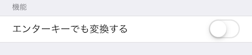

Yomigana
===

日本語のテキストを入力したら，それをルビに直したテキストを出力するアプリ


## Description

日本語のテキストを入力したら，それをルビに直したテキストを出力します．

## Build

Xcode

- 10.2.1

Carthage

- 0.32.0 
- ライブラリのソースやバイナリーはgitに含めてないので，事前にライブラリのダウンロードが必要．

```
$ carthage bootstrap
```

もしくは

```
$ carthage update --platform ios
```


## Usage


テキストを入力して，変換ボタンを押すと，読み仮名が表示されます

- 読み仮名は履歴に追加されて表示されます（データは永続化してません）
- 履歴からシェア機能を使って外部と共有できます

### オプション機能

一行ずつ変換する

- 設定から「エンターキーでも変換する」を選択することができます
- 変換ボタンを押さなくても，エンターキーを押すごとに変換します
- この設定は UserDefault に保存されます

